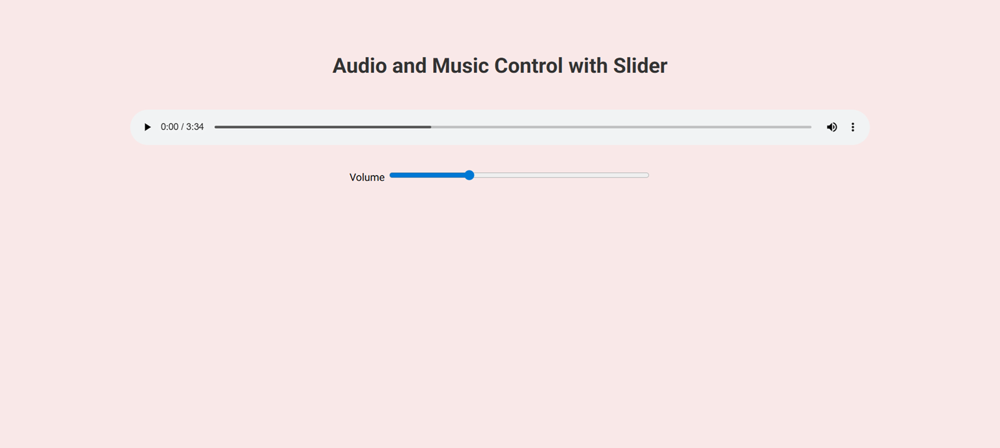

# Music Volume Controller
A functional and lightweight audio control interface built with HTML, CSS, and Vanilla JavaScript.

## Features
-Real-time volume synchronization using the input event.
-Volume normalization logic (converting 0-100 scale to 0.0-1.0).
-Clean and responsive UI with custom range slider.
-Native HTML5 Audio API integration.

## Technologies Used
-HTML5 (Audio, Range Input)
-CSS3 (Vazirmatn Font, Layout Styling)
-JavaScript (DOM Manipulation, Event Listeners)

## How to Run
Simply open index.html in any modern web browser.
